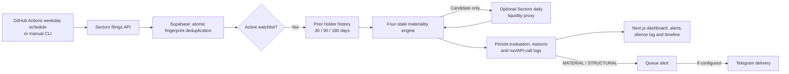

<div align="center">


# Autonomous Ownership Materiality Sentinel

**Ownership disclosure triage for Indonesian equities**<br/>
Sectors Hackathon 2026 · Track 2: Automation & Workflows

[Architecture](#architecture) · [Materiality](#materiality-and-explainable-silence) · [Evidence](#verified-evidence) · [Setup](#setup) · [Security](#security-and-limitations)

</div>

An ownership filing is useful only when a researcher can tell whether it changes the picture. A feed that pushes every filing spends attention on routine changes; a silent filter is hard to trust. This project turns Sectors ownership disclosures into **reviewable decisions**: it remembers each watched holder's prior activity, classifies the current event, and records why it alerted or stayed silent. It provides analysis, not investment recommendations.

## Architecture



The worker bounds filing pages and Sectors API attempts, processes filings in timestamp order, and can recover a filing that was ingested but not evaluated in an earlier run. Supabase stores the original filing, the decision, alert state, and execution evidence. The web app reads those persisted records; GitHub Actions runs the production schedule.

## Materiality and explainable silence

The deterministic engine assigns one of four states. These are classification rules, not calibrated investment signals.

| State | Current rule examples | Result |
| --- | --- | --- |
| `STRUCTURAL` | Stake shift of at least 5 percentage points, or a position reduced to 20% or less of its previous size | Persist and queue an alert |
| `MATERIAL` | Stake shift of at least 1 percentage point, relative share-position change of at least 10%, three same-direction holder events within 180 days, or two independent `WATCH` dimensions | Persist and queue an alert |
| `WATCH` | One watch dimension, such as a 0.25-point stake shift or two same-direction events within 180 days | Persist with suppression reasons; no push |
| `SILENT` | No material or watch rule met | Persist with suppression reasons; no push |

An explicit new position can also be `MATERIAL`. When transaction value and daily data are available, the engine compares value with the median of up to 20 daily `close × volume` observations; that is a **liquidity proxy**, not exact traded turnover. Daily data is requested only for candidates. Share-based relative position change is calculated only when the share counts exist; missing values are not treated as zero.

For evaluated watchlist filings, `WATCH` and `SILENT` retain reason codes such as `BELOW_PUSH_THRESHOLD`, `SMALL_ABSOLUTE_CHANGE`, and `NO_REPEAT_PATTERN`. Researchers can inspect the filing timestamp, source link when supplied, decision, and prior-holder timeline. Filings outside the active watchlist are ingested but not materiality-evaluated by this worker.

## Autonomous workflow

[The scheduled workflow](.github/workflows/scheduled-monitor.yml) runs on weekdays at **10:30, 12:30, 15:30, and 18:30 WIB** (`03:30, 05:30, 08:30, 11:30 UTC`). GitHub `workflow_dispatch` provides a manual recovery path. The defaults are three filing pages and 15 Sectors API attempts per run. A page-capped run can be `PARTIAL`; inspect the run log before claiming complete coverage. GitHub schedules can be delayed or skipped, so configuration alone is not proof of execution.

The worker queues `MATERIAL` and `STRUCTURAL` alerts in Supabase. Telegram delivery is optional and disabled when its credentials are absent. Without delivery, the app does not report an invented interruption-reduction or duplicate-alert rate: those metrics need actual sends. Run records include status, scanned/new/eligible counts, suppression and alert counts, latency, estimated credits, and errors.

## Verified evidence

The [first independently verified GitHub scheduled run](https://github.com/tonny2305/sectors_hackathon/actions/runs/36023434752) completed on **24 September 2026** and persisted as `SCHEDULED_CRON`. It scanned **8 filings**, found **1 eligible `STRUCTURAL` event**, made **1 Sectors API attempt** (about **1 estimated credit**), and queued **1 alert** without Telegram delivery. GitHub recorded its start at 15:53 UTC, roughly 4 hours 23 minutes after the 11:30 UTC slot. This proves one unattended execution, not schedule punctuality or continuous coverage.

The hosted Supabase schema and a bounded live Sectors ingestion have been checked; repeating the ingestion created no duplicate filings, evaluations, or alerts. Tests, typecheck, and production build passed at the audited baseline. The hosted RLS policies, constraints, and RPC privileges still need an administrative review with [the read-only audit SQL](supabase/verify_security.sql). A public web deployment has not been verified. No screenshots or demonstration metrics are presented as live evidence.

## Web app

| Route | What it shows |
| --- | --- |
| `/` | Attention summary, recent decisions, and recorded runs |
| `/alerts` | Persisted `MATERIAL` and `STRUCTURAL` events |
| `/alerts/[id]` | Filing evidence, decision reasons, and prior-holder timeline |
| `/suppressed` | `WATCH` and `SILENT` decisions with suppression reasons |
| `/runs` | Execution status, counts, latency, and estimated credit usage |
| `/watchlist` | Hosted symbols; edits require a configured admin token |
| `/api/health` | Database connectivity and configuration status; scheduled-run status reflects recorded rows |

Empty views show empty states, and unavailable rates show `N/A`; they do not display sample filings or claim successful delivery.

## Setup

Requires **Node.js 24+**, a Sectors API key, and a Supabase project.

```bash
npm ci
cp .env.example .env
```

Set `SECTORS_API_KEY`, `NEXT_PUBLIC_SUPABASE_URL`, and `SUPABASE_SERVICE_ROLE_KEY` in `.env`. Apply [the database migration](supabase/migrations/202609240001_data_core.sql) in Supabase and configure at least one active watchlist symbol. Keep `.env` out of Git.

```bash
npm run dev
npm run monitor -- 2026-09-24 2026-09-24
npm run ingest -- 2026-09-24 2026-09-24
```

`monitor` evaluates watched filings; `ingest` performs data-core ingestion without materiality evaluation. Omit the monitor dates to use the current Jakarta date. For GitHub Actions, set repository secrets `SECTORS_API_KEY`, `NEXT_PUBLIC_SUPABASE_URL`, and `SUPABASE_SERVICE_ROLE_KEY`. Optional Telegram delivery requires secrets `TELEGRAM_BOT_TOKEN` and `TELEGRAM_CHAT_ID`, plus repository variable `APP_BASE_URL` for public event links. The page and attempt caps can be set with repository variables `MAX_FILINGS_PAGES_PER_RUN` and `MAX_SECTORS_API_ATTEMPTS_PER_RUN`.

For a read-only Vercel web deployment, set only `NEXT_PUBLIC_SUPABASE_URL` and server-side `SUPABASE_SERVICE_ROLE_KEY`; the web app does not need `SECTORS_API_KEY` while GitHub Actions owns monitoring. Do not configure a second production schedule.

## Security and limitations

The service-role key, Sectors key, and Telegram credentials belong only in server or workflow environments. The migration enables RLS, defines uniqueness constraints, and restricts table/RPC privileges; **the hosted configuration must still be verified** using `supabase/verify_security.sql` in the Supabase SQL Editor. Do not infer hosted policy status from the migration file alone.

`POST /api/monitor/run` requires a separate `MONITOR_TRIGGER_TOKEN`; watchlist writes require `WATCHLIST_ADMIN_TOKEN`. Each token must be at least 32 characters. Leave both unset for a read-only web deployment: unconfigured write endpoints fail closed. The dashboard uses server-side Supabase access, and `NEXT_PUBLIC_SUPABASE_URL` is public by design; never expose the service-role key to browser code. Health reflects the deployed app's own environment, so a read-only web deployment can report the Sectors key as missing while the GitHub worker remains configured.

The engine's thresholds are v1 engineering choices that need calibration against authenticated historical data. The liquidity proxy, watchlist scope, bounded pagination, and schedule delays limit what a run can claim. A queued alert is not a delivered push; duplicate-delivery and explainability rates remain unmeasured until there are actual sends. This project is for information and analysis only, not financial, legal, or investment advice.

## Verification

```bash
npm test
npm run typecheck
npm run build
```

The suite covers API parsing and pagination, deduplication, PostgreSQL migration behavior, four-state classification, holder escalation and ordering, worker recovery, route authorization, and metrics with no delivery. There is no lint script.
