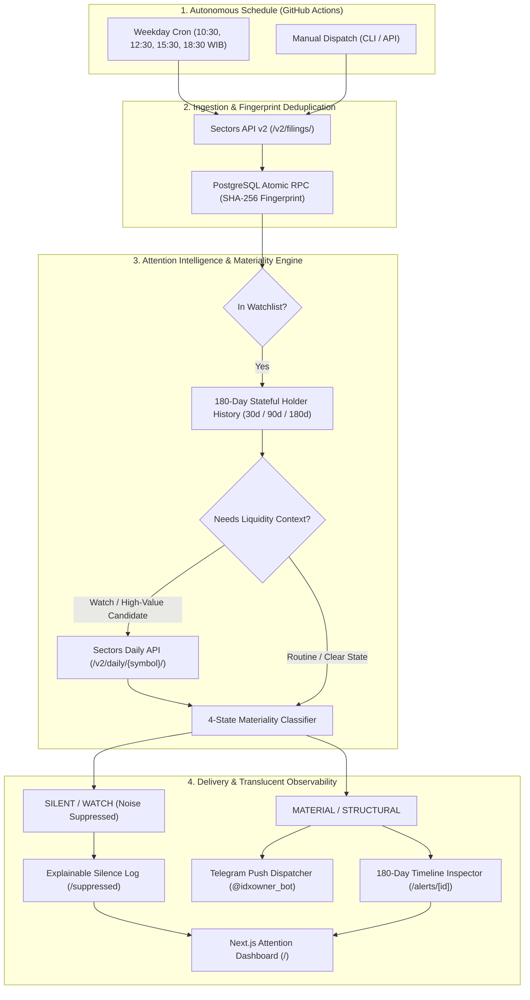

<!-- prettier-ignore -->
<div align="center">


# Autonomous Ownership Materiality Sentinel

*Autonomous Attention & Materiality Intelligence Layer for Indonesian Stock Disclosures (IDX)*

[](https://github.com)
[-10b981?style=flat-square&logo=vitest&logoColor=white)](tests/)
[](https://nodejs.org)
[](https://www.typescriptlang.org)
[-black?style=flat-square&logo=next.js&logoColor=white)](https://nextjs.org)
[](https://supabase.com)
[](https://sectors.app)
[](LICENSE)

⭐ **Sectors Hackathon 2026 — Track 2: Automation & Workflows**

[Overview](#overview) • [Architecture](#architecture) • [Features](#key-features--championship-moats) • [Getting Started](#getting-started) • [Automation & Schedules](#automation--scheduled-workflows) • [Attention Metrics](#attention-intelligence-metrics) • [API Reference](#api-reference) • [Verification](#verification--test-suite)

</div>

---

## Overview

Financial markets do not suffer from a lack of data; they suffer from an **attention-allocation crisis**.

An equity researcher covering Indonesian listed equities (IDX) faces dozens of insider and major-shareholder filings every trading day. Most tools operate on naive triggers: `New Filing -> Push Notification`. This creates severe alert fatigue because over **90% of raw disclosures represent routine noise** (e.g., minor transactions $<0.05\%$, internal custody reallocations, or recurring administrative changes).

The **Autonomous Ownership Materiality Sentinel** sits between raw IDX disclosures from **Sectors API v2** and human attention. It operates as an autonomous triage engine that separates routine filings from genuine market signals using **180-day stateful holder memory**, **credit-aware enrichment routing**, and **explainable noise suppression**.

> [!TIP]
> **Product Thesis: Silence is an Active Decision**  
> The Sentinel is equally valuable when it pushes a high-priority alert as when it **intentionally stays silent**. Every suppressed disclosure is audited with explainable reason codes so researchers can trust the filter.

---

## Architecture



---

## Key Features & Championship Moats

- 🧠 **180-Day Stateful Holder Memory**:  
  Tracks sequential holder actions across 30, 90, and 180-day lookback windows. Small transactions that appear negligible in isolation escalate automatically upon repeated accumulation:
  $$\text{Event 1: } +0.18\,\text{pp} \rightarrow \mathbf{SILENT} \quad\Longrightarrow\quad \text{Event 2: } +0.21\,\text{pp} \rightarrow \mathbf{WATCH} \quad\Longrightarrow\quad \text{Event 3: } +0.24\,\text{pp} \rightarrow \mathbf{MATERIAL}$$

- 🛡️ **Explainable Silence (Zero Silent Discards)**:  
  Every suppressed disclosure is recorded in PostgreSQL with explicit suppression reason codes (`SMALL_ABSOLUTE_CHANGE`, `NO_REPEAT_PATTERN`, `BELOW_PUSH_THRESHOLD`). Nothing disappears into a black box.

- ⚡ **Credit-Aware Routing**:  
  Optimizes Sectors API credit expenditure by only invoking the `/v2/daily/{symbol}/` endpoint when an event is a candidate for liquidity-relative escalation ($\ge 10\,\text{bps}$ stake shift or base state `WATCH`). Routine events spend exactly 1 credit.

- 📊 **Real-Time Attention Intelligence Metrics**:  
  Calculates and persists quantitative attention metrics for every autonomous run:
  - **Interruption Reduction Rate** ($\ge 90\%$ target)
  - **Duplicate Alert Rate** ($0\%$ target)
  - **Explainability Coverage** ($100\%$ target)

- 📱 **Targeted Telegram Dispatcher**:  
  Pushes actionable markdown alerts to Telegram only for `MATERIAL` and `STRUCTURAL` shifts, complete with stake change, transacted shares, IDR transaction value, decision rationale, and direct links to the web inspector.

- 🖥️ **Full-Stack Glassmorphism Web App**:  
  Built on Next.js 16 (App Router) and vanilla CSS design system featuring live attention dashboard, priority alerts inbox, explainable silence table, run history audit log, and interactive ticker watchlist manager.

---

## 4-State Materiality Framework

| State | Color Code | Description | Action / Delivery |
| :--- | :---: | :--- | :--- |
| **`STRUCTURAL`** | 🟣 Purple | M&A shifts, new $\ge 5\%$ major blockholder entries, total liquidations $\le 0.1\%$, or transactions $\ge 30\%$ of 20-day median turnover. | **Immediate Telegram Push Alert** + Priority Inbox |
| **`MATERIAL`** | 🟡 Amber | Stake jump $\ge 1.0\,\text{pp}$, rapid accumulation ($\ge 3$ consecutive buys within 180d), or significant liquidity impact ($\ge 10\%$ turnover). | **Immediate Telegram Push Alert** + Priority Inbox |
| **`WATCH`** | 🔵 Blue | Borderline stake change ($0.25 - 0.99\,\text{pp}$) or second consecutive transaction ($2\times$) requiring close observation. | **Suppressed from Push** $\rightarrow$ Saved to Audit Table |
| **`SILENT`** | ⚪ Gray | Routine, minor holding adjustments ($<0.25\,\text{pp}$) with no repeated accumulation pattern. | **Suppressed from Push** $\rightarrow$ Saved to Audit Table |

---

## Getting Started

### Prerequisites

- **Node.js**: `v24.x` or higher (uses native `--conditions=react-server` and `--experimental-strip-types`)
- **Sectors API Key**: Available from [sectors.app](https://sectors.app)
- **Supabase Project**: Free PostgreSQL instance from [supabase.com](https://supabase.com)
- **Telegram Bot** *(Optional for push)*: Created via `@BotFather`

### 1. Clone & Install Dependencies

```bash
git clone https://github.com/tonny2305/sectors_hackathon.git
cd sectors_hackathon
npm install
```

### 2. Configure Environment Variables

Copy `.env.example` to `.env` and fill in your credentials:

```bash
cp .env.example .env
```

| Variable | Required | Description |
| :--- | :---: | :--- |
| `SECTORS_API_KEY` | **Yes** | Your API token from Sectors Financial API |
| `NEXT_PUBLIC_SUPABASE_URL` | **Yes** | Supabase REST URL (`https://your-project.supabase.co`) |
| `SUPABASE_SERVICE_ROLE_KEY` | **Yes** | Supabase Secret Service Role Key (server-only) |
| `NEXT_PUBLIC_SUPABASE_ANON_KEY`| Optional | Supabase Anonymous Key |
| `TELEGRAM_BOT_TOKEN` | Optional | Telegram Bot token from `@BotFather` |
| `TELEGRAM_CHAT_ID` | Optional | Target Telegram user or group chat ID |
| `MAX_FILINGS_PAGES_PER_RUN` | Optional | Pagination depth cap per cycle (default: `3`) |
| `APP_BASE_URL` | Optional | Base URL for inspection deep links (default: `http://localhost:3000`) |

### 3. Apply Database Migration

Open your Supabase SQL Editor and run the migration script located at:
`supabase/migrations/202609240001_data_core.sql`

This creates all required tables, foreign keys, deduplication indexes, and the atomic `ingest_filings` RPC function.

### 4. Run Development Server

```bash
npm run dev
```

Open [http://localhost:3000](http://localhost:3000) in your browser.

---

## Automation & Scheduled Workflows

The system runs autonomously in production via GitHub Actions, and can also be triggered manually on-demand.

### Scheduled Cron (GitHub Actions)

Configured in [`.github/workflows/scheduled-monitor.yml`](.github/workflows/scheduled-monitor.yml), the monitor executes **4 times every trading day (Monday – Friday)** aligned with Indonesia Stock Exchange (IDX) sessions:

```cron
# 03:30, 05:30, 08:30, 11:30 UTC -> 10:30, 12:30, 15:30, 18:30 WIB
schedule:
  - cron: '30 3,5,8,11 * * 1-5'
```

| Time (WIB) | Time (UTC) | Trading Session Context |
| :--- | :---: | :--- |
| **10:30 WIB** | `03:30 UTC` | Mid Session 1 (Opening disclosures) |
| **12:30 WIB** | `05:30 UTC` | Post Session 1 / Lunch Break |
| **15:30 WIB** | `08:30 UTC` | Mid Session 2 (Pre-closing action) |
| **18:30 WIB** | `11:30 UTC` | Post Market Close (Evening disclosure batch) |

### On-Demand CLI Commands

```bash
# Execute autonomous monitoring cycle for today's disclosures
npm run monitor

# Ingest & evaluate a specific historical date range
npm run ingest -- 2024-07-01 2024-07-15
```

---

## Attention Intelligence Metrics

For every monitoring cycle, the Sentinel measures and logs real quantitative attention metrics:

$$\text{Interruption Reduction} = 1 - \left(\frac{\text{Push Alerts Sent}}{\text{Eligible New Filings}}\right)$$

$$\text{Duplicate Alert Rate} = \frac{\text{Duplicate Push Alerts}}{\text{Total Push Alerts}} = 0.00\%$$

$$\text{Explainability Coverage} = \frac{\text{Push Alerts with Reason Codes}}{\text{Total Push Alerts}} = 100.00\%$$

### Example Run Output

```json
{
  "runId": "9c167930-6d48-484f-8620-724251a4bc0a",
  "status": "COMPLETE",
  "recordsScanned": 90,
  "newEvents": 90,
  "attentionMetrics": {
    "interruptionReduction": 0.944,
    "duplicateAlertRate": 0.0,
    "explainabilityCoverage": 1.0,
    "silentCount": 68,
    "watchCount": 17,
    "materialCount": 4,
    "structuralCount": 1,
    "suppressedCount": 85,
    "pushAlertsSent": 5
  },
  "estimatedCredits": 7,
  "apiLatencyMsTotal": 1407
}
```

---

## Web Application Sitemap

| Route | Page | Purpose |
| :--- | :--- | :--- |
| **`/`** | Attention Dashboard | Live KPI summary, interruption reduction rate, recent alerts & suppressed feed. |
| **`/alerts`** | Material Alerts Inbox | Chronological feed of high-priority disclosures with state badges and reason pills. |
| **`/alerts/[id]`** | Event Inspection & Timeline | Deep forensic evidence view with 180-day sequential holder timeline and raw JSON. |
| **`/suppressed`** | Explainable Silence Log | Transparent noise suppression audit table explaining why each routine event was silenced. |
| **`/runs`** | Autonomous Run History | Execution log of scheduled crons, latency, credit expenditure, and scanned records. |
| **`/watchlist`** | Watchlist Manager | Interactive ticker manager with presets for Big Banks, LQ45, Mining, and Conglomerates. |

---

## API Reference

### Health & System Status

```http
GET /api/health
```

**Response `200 OK`**:
```json
{
  "status": "HEALTHY",
  "timestamp": "2026-09-24T08:28:21.082Z",
  "engineVersion": "v2.0.0-materiality-sentinel",
  "configuration": {
    "sectorsApi": "CONFIGURED",
    "supabase": "CONFIGURED",
    "telegramAlerts": "ENABLED",
    "database": "CONNECTED"
  },
  "monitoring": {
    "activeWatchlistCount": 4,
    "scheduler": "WEEKDAY_CRON (10:30, 12:30, 15:30, 18:30 WIB)",
    "maxPagesCap": 3
  }
}
```

### Watchlist Management

```http
GET /api/watchlist
POST /api/watchlist      {"symbol": "BBCA.JK"}
DELETE /api/watchlist?symbol=BBCA.JK
```

### Run History & Alerts

```http
GET /api/runs
GET /api/alerts
GET /api/suppressed
```

---

## Verification & Test Suite

The project enforces strict unit, integration, and security test coverage:

```bash
# Run full Vitest test suite (88 automated tests)
npm test

# Run strict TypeScript compiler verification
npm run typecheck

# Build Next.js production bundle with Turbopack
npm run build
```

### Test Coverage Highlights

- **`tests/materiality.test.ts`**: Verifies 4-state classifier thresholds, relative position delta, and suppression logic.
- **`tests/escalation.test.ts`**: Verifies stateful escalation across 30d, 90d, and 180d lookback windows.
- **`tests/persistence.test.ts`**: Verifies PostgreSQL schema and SHA-256 deduplication using in-memory PGlite.
- **`tests/client.test.ts`**: Verifies bounded retries, rate limiting (429), exponential backoff, and pagination schemas.
- **`tests/security.test.ts`**: Verifies zero secret leakage into client bundles and strict `server-only` boundary enforcement.
- **`tests/telegram.test.ts`**: Verifies alert message markdown formatting, character escaping, and payload construction.

---

## Project Structure

```
.
├── .github/workflows/
│   ├── scheduled-monitor.yml   # Weekday 4x cron schedule
│   └── ci.yml                  # Build, test, and typecheck CI
├── app/                        # Next.js App Router
│   ├── alerts/                 # Priority alerts feed & [id] detail inspector
│   ├── api/                    # REST API endpoints (health, watchlist, runs, etc.)
│   ├── runs/                   # Autonomous run history
│   ├── suppressed/             # Explainable silence log
│   ├── watchlist/              # Watchlist manager & client component
│   ├── globals.css             # Glassmorphism design system
│   ├── layout.tsx              # Root layout with responsive Navbar & Footer
│   └── page.tsx                # Attention dashboard
├── components/                 # Reusable UI components (Navbar, Footer, Timeline)
├── lib/
│   ├── alerts/telegram.ts      # Telegram notification formatter & dispatcher
│   ├── automation/monitor.ts   # Core autonomous monitoring orchestrator
│   ├── db/store.ts             # Supabase PostgreSQL data access layer
│   ├── materiality/            # Materiality classifier, holder memory, metrics
│   └── sectors/                # Sectors API v2 client, Zod schemas, normalizer
├── scripts/
│   ├── ingest.ts               # CLI historical date-range ingestion
│   └── monitor.ts              # CLI autonomous monitor runner
├── supabase/migrations/        # PostgreSQL SQL schema migrations
└── tests/                      # Automated Vitest test suite (88 tests)
```

---

## Disclaimer

This software is an analytical and information intelligence tool developed for the **Sectors Hackathon 2026**. It does not constitute financial, legal, or investment advice. It does not provide buy/sell/hold recommendations, target prices, or portfolio management services. All disclosure evidence is sourced from publicly filed records via the [Sectors Financial API](https://sectors.app).

---

## License

This project is licensed under the [MIT License](LICENSE).
