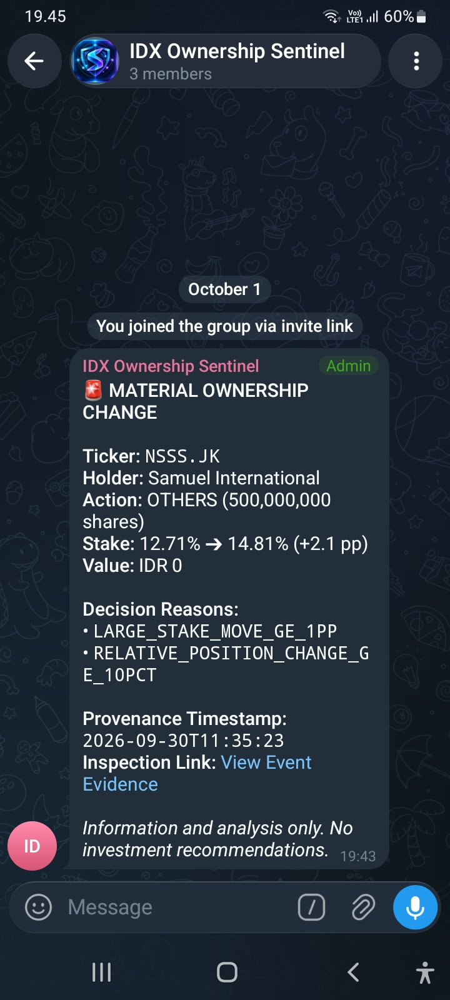

# Telegram Delivery Evidence

**Status: LIVE DELIVERY, PERSISTED IDEMPOTENCY, AND GROUP SCREENSHOT EVIDENCE SECURED**

This controlled proof used the delivery-only command for one persisted alert. It did not run `runMonitoringCycle` and did not load or call the Sectors API.

## Destination Verification

- Telegram API result: `ok: true`
- Chat type: `group`
- Chat title: `IDX Ownership Sentinel`
- Bot token and numeric chat ID are intentionally not recorded.

## Delivered Alert Metadata

- **Alert UUID**: `09d3ffa7-661d-4143-9e88-f36155d56769`
- **Ticker**: `NSSS.JK`
- **Materiality**: `MATERIAL`
- **Channel**: `telegram`

## Controlled Execution Log

### 1. First Execution

Command:

```powershell
npm run telegram:deliver -- 09d3ffa7-661d-4143-9e88-f36155d56769
```

Sanitized result:

```json
{"alertId":"09d3ffa7-661d-4143-9e88-f36155d56769","status":"SENT","messageId":"88"}
```

Telegram accepted the send and returned external message ID `88`.

### 2. Persisted Database Verification

Sanitized Supabase row observed after the first send:

```json
{
  "id": "09d3ffa7-661d-4143-9e88-f36155d56769",
  "delivery_status": "SENT",
  "sent_at": "2026-10-01T12:43:51.59+00:00",
  "external_message_id": "88"
}
```

The same values remained after the second execution.

### 3. Second Execution / Idempotency Proof

The exact same command was run once more:

```powershell
npm run telegram:deliver -- 09d3ffa7-661d-4143-9e88-f36155d56769
```

Sanitized result:

```json
{"alertId":"09d3ffa7-661d-4143-9e88-f36155d56769","status":"SKIPPED"}
```

No second Telegram send was initiated by the delivery path. The persisted status, `sent_at`, and external message ID remained unchanged.

## Isolation & API Statement

- Sectors API requests during this controlled proof: `0`.
- `runMonitoringCycle` was not invoked.
- `SECTORS_API_KEY` was not loaded or used by the delivery command.
- Only the persisted alert/evaluation data, Supabase REST API, and Telegram Bot API were used.

## Screenshot Evidence



- Screenshot file: `docs/evidence/telegram/telegram-group-delivery-20261001.png`
- Screenshot group title: `IDX Ownership Sentinel`
- Screenshot local message time: approximately `19:43 WIB`
- Persisted UTC `sent_at`: `2026-10-01T12:43:51.59+00:00`
- Converted local time: approximately `19:43 WIB` (`UTC+07:00`)
- The visible Telegram message timestamp is consistent with the persisted delivery evidence.

## Test & Build Verification

- `npm test`: PASS — 14 test files, 110 tests
- `npm run typecheck`: PASS
- `git diff --check`: PASS
- Secret scan: PASS — 0 tracked env files, 0 high-confidence literal secret matches
